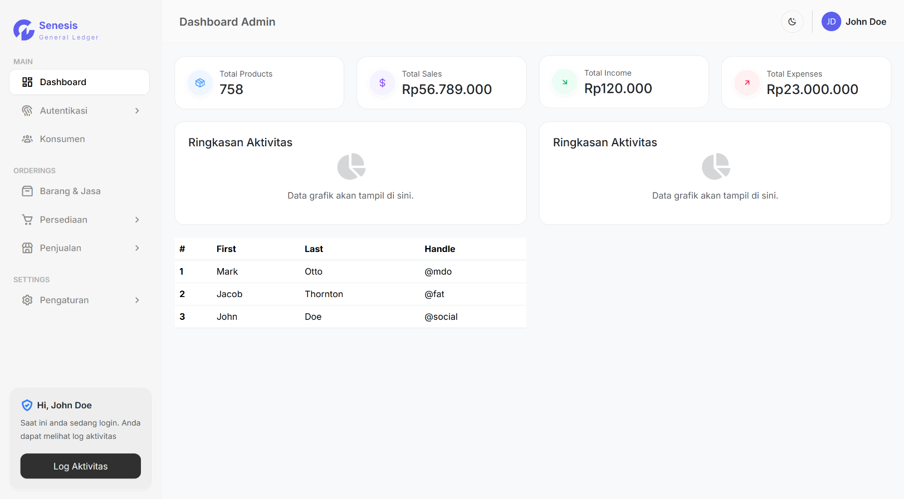
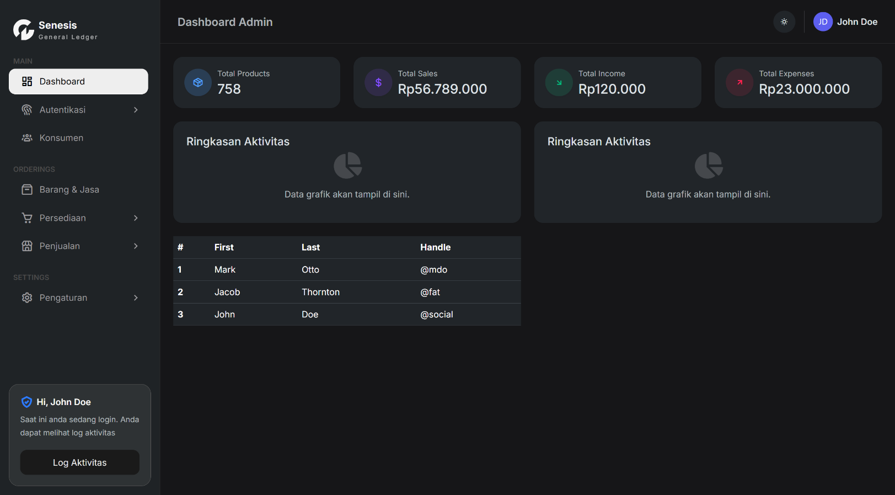

# 🚀 Modern Admin Dashboard Pro

A sleek, responsive, and high-performance Admin Dashboard built with **HTML5, CSS3 (SCSS style), and Bootstrap 5**. Designed for speed, scalability, and a premium user experience.


---

## ✨ Key Features

- **🌓 Dynamic Dark Mode**: Seamlessly switch between Light and Dark themes with saved user preferences.
- **📱 Multi-Device Responsive**: Fully optimized for Desktop, Tablet, and Mobile views.
- **📂 Interactive Sidebar**: Multi-level dropdown menus with smooth Bootstrap Collapse transitions.
- **⚡ Performance Optimized**: Utilizes the `contain` CSS property for fast rendering and reduced layout shifts.
- **💎 Modern UI/UX**: Clean "Inter" typography, glassmorphism effects, and consistent icon sets via Font Awesome 6.
- **📍 Sticky Navigation**: Stay oriented with a fixed top navbar and intelligent scroll management.

---

## 🛠️ Technical Stack

- **Frontend:** HTML5, CSS3 (Modern Flexbox & Grid)
- **Framework:** Bootstrap 5.3
- **Icons:** Font Awesome 6 + Custom Inline SVGs
- **Typography:** Google Fonts (Inter)
- **Logic:** Vanilla JavaScript (Theme switcher & Sidebar toggles)

---

## 📸 Screenshots

### Light Mode


### Dark Mode


---

## 🚀 Getting Started

Follow these steps to set up the project locally:

1. **Clone the repository**
   ```bash
   git clone [https://github.com/willyharefa/admin-dashboard-pro.git](https://github.com/willyharefa/admin-dashboard-pro.git)
